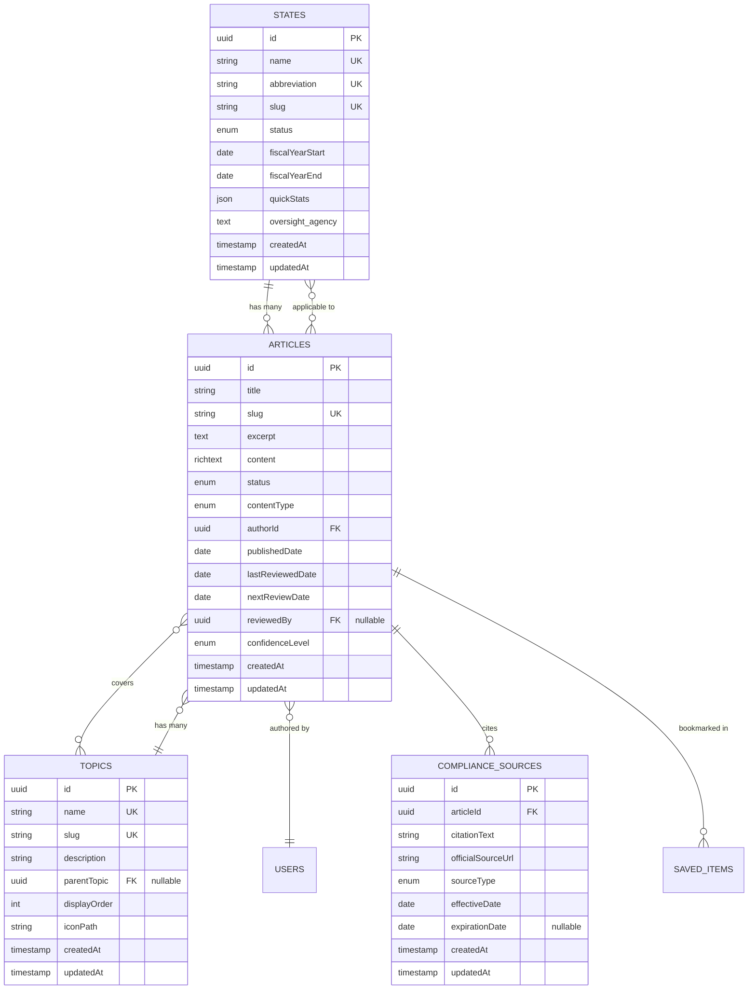
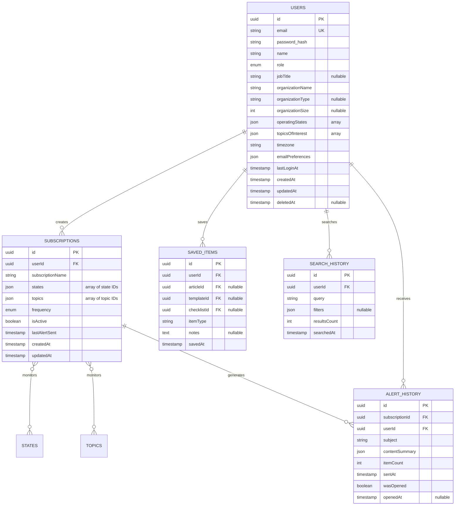
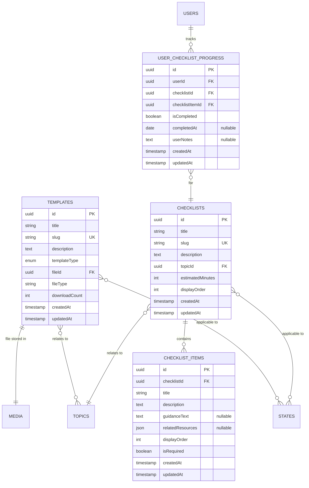

# OpenGov Compliance Center - Data Model Design

**Version:** 1.0  
**Date:** December 14, 2025  
**Status:** Ready for Implementation  
**Author:** Backend Developer

---

## Table of Contents

1. [Executive Summary](#executive-summary)
2. [Design Principles](#design-principles)
3. [Entity Relationship Diagrams](#entity-relationship-diagrams)
4. [Collection Schemas](#collection-schemas)
5. [Relationships & Associations](#relationships--associations)
6. [Database Considerations](#database-considerations)
7. [Search & Indexing Strategy](#search--indexing-strategy)
8. [Migration & Implementation Plan](#migration--implementation-plan)
9. [API Endpoints Reference](#api-endpoints-reference)

---

## Executive Summary

This document defines the comprehensive data model for the OpenGov Compliance Center MVP, building upon existing PayloadCMS collections (Users, States, Articles, Pages, Media) and extending them with new collections required for the compliance guidance platform.

### Key Objectives

1. **Extend existing collections** to support MVP requirements
2. **Add new collections** for topics, subscriptions, saved items, templates, and checklists
3. **Establish relationships** between entities for content discovery and personalization
4. **Optimize for search** with full-text indexing and faceted filtering
5. **Support compliance metadata** (sources, effective dates, review cycles)
6. **Enable audit trails** for content quality and user actions

### Data Model Overview

| Collection | Purpose | Relationships | Priority |
|------------|---------|---------------|----------|
| **Users** (existing) | Authentication, profiles, roles | → SavedItems, Subscriptions, Checklists | P0 (MVP) |
| **States** (existing) | State profiles, metadata | ← Articles, Topics, Templates | P0 (MVP) |
| **Articles** (existing) | Compliance content, regulations | → States, Topics, Sources | P0 (MVP) |
| **Topics** (new) | Category taxonomy | ← Articles, Checklists, Templates | P0 (MVP) |
| **ComplianceSources** (new) | Statute/regulation citations | → Articles | P0 (MVP) |
| **Subscriptions** (new) | User alert preferences | → Users, States, Topics | P0 (MVP) |
| **SavedItems** (new) | User bookmarks | → Users, Articles, Templates | P0 (MVP) |
| **Templates** (new) | Document templates | → States, Topics | P1 (Post-MVP) |
| **Checklists** (new) | Interactive checklists | → Topics, States | P1 (Post-MVP) |
| **UserChecklistProgress** (new) | Checklist completion tracking | → Users, Checklists | P1 (Post-MVP) |
| **AlertHistory** (new) | Notification audit log | → Users, Subscriptions | P1 (Post-MVP) |
| **SearchHistory** (new) | User search tracking | → Users | P1 (Post-MVP) |
| **Pages** (existing) | CMS pages | - | P0 (MVP) |
| **Media** (existing) | Asset storage | ← Articles, Templates, States | P0 (MVP) |

---

## Design Principles

### 1. Normalize for Flexibility
- **Topics as independent entities** - Not embedded in Articles, allowing multi-state, multi-topic associations
- **Separate ComplianceSources** - Reusable citations across multiple articles
- **Junction tables** - Many-to-many relationships for Articles ↔ States, Articles ↔ Topics

### 2. Optimize for Search & Discovery
- **Full-text search fields** on Articles (title, excerpt, content), Topics (name, description), States (name)
- **Faceted filtering** by state, topic, content type, date range
- **Denormalized metadata** for performance (article counts per state/topic)

### 3. Support Content Quality
- **Review lifecycle fields** - lastReviewedDate, nextReviewDate, reviewedBy, confidenceLevel
- **Version control** - Payload's built-in draft/publish with version history
- **Source attribution** - ComplianceSources with URLs, effective dates, citations

### 4. Enable Personalization
- **User preferences** - Operating states, topics of interest, notification frequency
- **Activity tracking** - SavedItems, SearchHistory, AlertHistory
- **Recommendation signals** - Popular content, recent updates, related content

### 5. Ensure Data Integrity
- **Required fields** for critical metadata (title, state, topic, effectiveDate)
- **Referential integrity** via Payload relationships (cascade deletes where appropriate)
- **Validation rules** - Email format, date logic (effectiveDate < expirationDate), enum constraints

### 6. Audit & Compliance
- **Audit timestamps** - createdAt, updatedAt (automatic via Payload)
- **Soft deletes** - For user data (GDPR/CCPA compliance)
- **Change tracking** - Version history for all content

---

## Entity Relationship Diagrams

### Core Content Relationships



### User Personalization & Activity



### Resources & Templates



---

## Collection Schemas

### 1. Users Collection (Enhanced)

**Slug:** `users`  
**Purpose:** User authentication, profiles, and preferences  
**Priority:** P0 (MVP)

#### Schema Definition

```typescript
import type { CollectionConfig } from 'payload'

export const Users: CollectionConfig = {
  slug: 'users',
  admin: {
    useAsTitle: 'email',
    defaultColumns: ['email', 'name', 'role', 'organizationName', 'lastLoginAt'],
    group: 'Users',
  },
  auth: {
    tokenExpiration: 7200, // 2 hours
    verify: true, // Email verification required
    maxLoginAttempts: 5,
    lockTime: 600000, // 10 minutes
  },
  access: {
    read: ({ req: { user } }) => {
      if (user?.role === 'admin') return true
      return { id: { equals: user?.id } }
    },
    create: () => true, // Public registration
    update: ({ req: { user } }) => {
      if (user?.role === 'admin') return true
      return { id: { equals: user?.id } }
    },
    delete: ({ req: { user } }) => user?.role === 'admin',
  },
  fields: [
    // Basic Information
    {
      name: 'name',
      type: 'text',
      required: true,
      label: 'Full Name',
    },
    {
      name: 'email',
      type: 'email',
      required: true,
      unique: true,
    },
    {
      name: 'role',
      type: 'select',
      required: true,
      defaultValue: 'viewer',
      options: [
        { label: 'Admin', value: 'admin' },
        { label: 'Editor', value: 'editor' },
        { label: 'Viewer', value: 'viewer' },
      ],
    },
    
    // Professional Information
    {
      name: 'jobTitle',
      type: 'text',
      label: 'Job Title / Role',
      admin: {
        placeholder: 'e.g., Finance Director, Compliance Officer',
      },
    },
    {
      name: 'organizationName',
      type: 'text',
      required: true,
      label: 'Organization Name',
      admin: {
        placeholder: 'e.g., Jefferson County, City of Boulder',
      },
    },
    {
      name: 'organizationType',
      type: 'select',
      label: 'Organization Type',
      options: [
        { label: 'County', value: 'county' },
        { label: 'City', value: 'city' },
        { label: 'Town', value: 'town' },
        { label: 'Special District', value: 'special_district' },
        { label: 'State Agency', value: 'state_agency' },
        { label: 'Consultant', value: 'consultant' },
        { label: 'Other', value: 'other' },
      ],
    },
    {
      name: 'organizationSize',
      type: 'select',
      label: 'Organization Size (Employees)',
      options: [
        { label: '1-25', value: 'small' },
        { label: '26-100', value: 'medium' },
        { label: '101-500', value: 'large' },
        { label: '500+', value: 'enterprise' },
      ],
    },
    
    // User Preferences
    {
      name: 'operatingStates',
      type: 'relationship',
      relationTo: 'states',
      hasMany: true,
      label: 'Operating States',
      admin: {
        description: 'States where your organization operates',
      },
    },
    {
      name: 'topicsOfInterest',
      type: 'relationship',
      relationTo: 'topics',
      hasMany: true,
      label: 'Topics of Interest',
      admin: {
        description: 'Compliance topics you want to monitor',
      },
    },
    {
      name: 'timezone',
      type: 'text',
      defaultValue: 'America/Denver',
      label: 'Timezone',
      admin: {
        description: 'Used for alert delivery scheduling',
      },
    },
    
    // Notification Preferences
    {
      name: 'emailPreferences',
      type: 'group',
      label: 'Email Preferences',
      fields: [
        {
          name: 'receiveProductUpdates',
          type: 'checkbox',
          defaultValue: true,
          label: 'Product Updates',
        },
        {
          name: 'receiveEducationalContent',
          type: 'checkbox',
          defaultValue: true,
          label: 'Educational Content',
        },
        {
          name: 'receiveEventInvitations',
          type: 'checkbox',
          defaultValue: true,
          label: 'Event Invitations',
        },
      ],
    },
    
    // Metadata
    {
      name: 'lastLoginAt',
      type: 'date',
      admin: {
        position: 'sidebar',
        readOnly: true,
        date: {
          pickerAppearance: 'dayAndTime',
        },
      },
    },
  ],
  timestamps: true,
}
```

#### Indexes

```sql
CREATE INDEX idx_users_email ON users(email);
CREATE INDEX idx_users_role ON users(role);
CREATE INDEX idx_users_organization ON users(organization_name);
CREATE INDEX idx_users_last_login ON users(last_login_at DESC);
```

---

### 2. States Collection (Enhanced)

**Slug:** `states`  
**Purpose:** State profiles with compliance metadata  
**Priority:** P0 (MVP)

#### Schema Definition

```typescript
import type { CollectionConfig } from 'payload'

export const States: CollectionConfig = {
  slug: 'states',
  admin: {
    useAsTitle: 'name',
    defaultColumns: ['name', 'abbreviation', 'status', 'fiscalYearStart', 'updatedAt'],
    group: 'Content',
  },
  access: {
    read: () => true,
    create: ({ req: { user } }) => user?.role === 'admin' || user?.role === 'editor',
    update: ({ req: { user } }) => user?.role === 'admin' || user?.role === 'editor',
    delete: ({ req: { user } }) => user?.role === 'admin',
  },
  fields: [
    // Basic Information
    {
      name: 'name',
      type: 'text',
      required: true,
      unique: true,
      label: 'State Name',
    },
    {
      name: 'abbreviation',
      type: 'text',
      required: true,
      unique: true,
      label: 'State Abbreviation',
      maxLength: 2,
      validate: (val) => {
        if (val && val.length !== 2) {
          return 'Abbreviation must be exactly 2 characters'
        }
        return true
      },
    },
    {
      name: 'slug',
      type: 'text',
      required: true,
      unique: true,
      admin: {
        position: 'sidebar',
      },
      hooks: {
        beforeValidate: [
          ({ value, data }) => {
            if (!value && data?.name) {
              return data.name.toLowerCase().replace(/\s+/g, '-')
            }
            return value
          },
        ],
      },
    },
    {
      name: 'status',
      type: 'select',
      required: true,
      defaultValue: 'draft',
      admin: {
        position: 'sidebar',
      },
      options: [
        { label: 'Draft', value: 'draft' },
        { label: 'Published', value: 'published' },
      ],
    },
    
    // Fiscal Information
    {
      name: 'fiscalYearStart',
      type: 'date',
      required: true,
      label: 'Fiscal Year Start Date',
      admin: {
        date: {
          pickerAppearance: 'dayOnly',
        },
        description: 'Typically July 1 for most states',
      },
    },
    {
      name: 'fiscalYearEnd',
      type: 'date',
      required: true,
      label: 'Fiscal Year End Date',
      admin: {
        date: {
          pickerAppearance: 'dayOnly',
        },
        description: 'Typically June 30 for most states',
      },
    },
    
    // State Characteristics
    {
      name: 'population',
      type: 'number',
      label: 'Population (Latest Census)',
    },
    {
      name: 'localGovernmentCount',
      type: 'number',
      label: 'Number of Local Governments',
    },
    {
      name: 'oversightAgency',
      type: 'group',
      label: 'State Oversight Agency',
      fields: [
        {
          name: 'name',
          type: 'text',
          label: 'Agency Name',
        },
        {
          name: 'website',
          type: 'text',
          label: 'Website URL',
        },
        {
          name: 'contactEmail',
          type: 'email',
          label: 'Contact Email',
        },
      ],
    },
    {
      name: 'uniqueCharacteristics',
      type: 'textarea',
      label: 'Unique Compliance Characteristics',
      admin: {
        description: 'e.g., Colorado TABOR, Louisiana criminal penalties',
      },
    },
    
    // Content Tabs (existing structure)
    {
      type: 'tabs',
      tabs: [
        {
          label: 'Overview',
          fields: [
            {
              name: 'hero',
              type: 'group',
              label: 'Hero Section',
              fields: [
                {
                  name: 'title',
                  type: 'text',
                  required: true,
                },
                {
                  name: 'subtitle',
                  type: 'textarea',
                },
                {
                  name: 'lastUpdated',
                  type: 'date',
                  required: true,
                  admin: {
                    date: {
                      pickerAppearance: 'dayOnly',
                    },
                  },
                },
              ],
            },
            {
              name: 'quickStats',
              type: 'array',
              label: 'Quick Stats',
              maxRows: 4,
              fields: [
                {
                  name: 'label',
                  type: 'text',
                  required: true,
                },
                {
                  name: 'value',
                  type: 'text',
                  required: true,
                },
                {
                  name: 'icon',
                  type: 'text',
                  label: 'Icon (emoji or class)',
                },
              ],
            },
          ],
        },
        {
          label: 'Financial Management',
          fields: [
            {
              name: 'financialManagement',
              type: 'group',
              fields: [
                {
                  name: 'requirements',
                  type: 'richText',
                  label: 'Requirements & Standards',
                },
                {
                  name: 'keyFeatures',
                  type: 'array',
                  label: 'Key Features',
                  fields: [
                    {
                      name: 'title',
                      type: 'text',
                      required: true,
                    },
                    {
                      name: 'description',
                      type: 'textarea',
                      required: true,
                    },
                    {
                      name: 'icon',
                      type: 'text',
                    },
                  ],
                },
              ],
            },
          ],
        },
        {
          label: 'Budgeting & Planning',
          fields: [
            {
              name: 'budgeting',
              type: 'group',
              fields: [
                {
                  name: 'requirements',
                  type: 'richText',
                  label: 'Requirements & Standards',
                },
                {
                  name: 'keyFeatures',
                  type: 'array',
                  label: 'Key Features',
                  fields: [
                    {
                      name: 'title',
                      type: 'text',
                      required: true,
                    },
                    {
                      name: 'description',
                      type: 'textarea',
                      required: true,
                    },
                  ],
                },
              ],
            },
          ],
        },
        {
          label: 'Procurement',
          fields: [
            {
              name: 'procurement',
              type: 'group',
              fields: [
                {
                  name: 'requirements',
                  type: 'richText',
                  label: 'Requirements & Standards',
                },
                {
                  name: 'keyFeatures',
                  type: 'array',
                  label: 'Key Features',
                  fields: [
                    {
                      name: 'title',
                      type: 'text',
                      required: true,
                    },
                    {
                      name: 'description',
                      type: 'textarea',
                      required: true,
                    },
                  ],
                },
              ],
            },
          ],
        },
        {
          label: 'Resources',
          fields: [
            {
              name: 'relatedArticles',
              type: 'relationship',
              relationTo: 'articles',
              hasMany: true,
              label: 'Related Articles',
            },
            {
              name: 'externalResources',
              type: 'array',
              label: 'External Resources',
              fields: [
                {
                  name: 'title',
                  type: 'text',
                  required: true,
                },
                {
                  name: 'url',
                  type: 'text',
                  required: true,
                },
                {
                  name: 'description',
                  type: 'textarea',
                },
              ],
            },
            {
              name: 'downloadableResources',
              type: 'array',
              label: 'Downloadable Resources',
              fields: [
                {
                  name: 'title',
                  type: 'text',
                  required: true,
                },
                {
                  name: 'file',
                  type: 'upload',
                  relationTo: 'media',
                  required: true,
                },
                {
                  name: 'description',
                  type: 'textarea',
                },
              ],
            },
          ],
        },
      ],
    },
    
    // Metadata
    {
      name: 'articleCount',
      type: 'number',
      defaultValue: 0,
      admin: {
        position: 'sidebar',
        readOnly: true,
        description: 'Auto-calculated count of related articles',
      },
    },
  ],
  timestamps: true,
}
```

#### Indexes

```sql
CREATE INDEX idx_states_slug ON states(slug);
CREATE INDEX idx_states_abbreviation ON states(abbreviation);
CREATE INDEX idx_states_status ON states(status);
CREATE FULLTEXT INDEX idx_states_search ON states(name, unique_characteristics);
```

---

### 3. Topics Collection (New)

**Slug:** `topics`  
**Purpose:** Hierarchical taxonomy for compliance categories  
**Priority:** P0 (MVP)

#### Schema Definition

```typescript
import type { CollectionConfig } from 'payload'

export const Topics: CollectionConfig = {
  slug: 'topics',
  admin: {
    useAsTitle: 'name',
    defaultColumns: ['name', 'parentTopic', 'articleCount', 'displayOrder', 'updatedAt'],
    group: 'Content',
  },
  access: {
    read: () => true,
    create: ({ req: { user } }) => user?.role === 'admin' || user?.role === 'editor',
    update: ({ req: { user } }) => user?.role === 'admin' || user?.role === 'editor',
    delete: ({ req: { user } }) => user?.role === 'admin',
  },
  fields: [
    {
      name: 'name',
      type: 'text',
      required: true,
      unique: true,
      label: 'Topic Name',
      admin: {
        placeholder: 'e.g., Budget Adoption, Procurement Methods',
      },
    },
    {
      name: 'slug',
      type: 'text',
      required: true,
      unique: true,
      admin: {
        position: 'sidebar',
      },
      hooks: {
        beforeValidate: [
          ({ value, data }) => {
            if (!value && data?.name) {
              return data.name
                .toLowerCase()
                .replace(/[^a-z0-9]+/g, '-')
                .replace(/(^-|-$)/g, '')
            }
            return value
          },
        ],
      },
    },
    {
      name: 'description',
      type: 'textarea',
      required: true,
      label: 'Topic Description',
      maxLength: 500,
      admin: {
        description: 'Plain-language description of this compliance topic (500 chars max)',
      },
    },
    {
      name: 'parentTopic',
      type: 'relationship',
      relationTo: 'topics',
      label: 'Parent Topic',
      admin: {
        description: 'Leave empty for top-level topics',
      },
    },
    {
      name: 'displayOrder',
      type: 'number',
      required: true,
      defaultValue: 0,
      label: 'Display Order',
      admin: {
        description: 'Lower numbers appear first',
      },
    },
    {
      name: 'iconPath',
      type: 'text',
      label: 'Icon Path',
      admin: {
        description: 'Path to SVG icon in /public/icons/',
        placeholder: 'e.g., OG-Icons_B&P-2c.svg',
      },
    },
    {
      name: 'color',
      type: 'text',
      label: 'Color Code',
      admin: {
        description: 'Hex color for visual identification',
        placeholder: '#3B82F6',
      },
    },
    
    // Metadata
    {
      name: 'articleCount',
      type: 'number',
      defaultValue: 0,
      admin: {
        position: 'sidebar',
        readOnly: true,
        description: 'Auto-calculated count of related articles',
      },
    },
  ],
  timestamps: true,
}
```

#### Indexes

```sql
CREATE INDEX idx_topics_slug ON topics(slug);
CREATE INDEX idx_topics_parent ON topics(parent_topic_id);
CREATE INDEX idx_topics_display_order ON topics(display_order ASC);
CREATE FULLTEXT INDEX idx_topics_search ON topics(name, description);
```

#### Example Data

```json
[
  {
    "name": "Financial Management",
    "slug": "financial-management",
    "description": "General ledger, fund accounting, financial reporting, and audit requirements",
    "parentTopic": null,
    "displayOrder": 1,
    "iconPath": "OG-Icons_FIN-2c.svg",
    "color": "#3B82F6"
  },
  {
    "name": "Budget Adoption",
    "slug": "budget-adoption",
    "description": "Requirements for annual budget preparation, public hearings, and formal adoption",
    "parentTopic": "financial-management",
    "displayOrder": 1,
    "iconPath": "OG-Icons_B&P-2c.svg",
    "color": "#3B82F6"
  },
  {
    "name": "Procurement & Contracting",
    "slug": "procurement-contracting",
    "description": "Competitive bidding, vendor management, contract requirements",
    "parentTopic": null,
    "displayOrder": 2,
    "iconPath": "OG-Icons_Purchasing-2c.svg",
    "color": "#10B981"
  }
]
```

---

### 4. Articles Collection (Enhanced)

**Slug:** `articles`  
**Purpose:** Compliance content with regulation details  
**Priority:** P0 (MVP)

#### Schema Definition

```typescript
import type { CollectionConfig } from 'payload'

export const Articles: CollectionConfig = {
  slug: 'articles',
  admin: {
    useAsTitle: 'title',
    defaultColumns: ['title', 'contentType', 'status', 'nextReviewDate', 'publishedDate'],
    group: 'Content',
  },
  access: {
    read: ({ req: { user } }) => {
      if (!user) {
        return { status: { equals: 'published' } }
      }
      return true
    },
    create: ({ req: { user } }) => user?.role === 'admin' || user?.role === 'editor',
    update: ({ req: { user } }) => user?.role === 'admin' || user?.role === 'editor',
    delete: ({ req: { user } }) => user?.role === 'admin',
  },
  versions: {
    maxPerDoc: 50,
    drafts: true,
  },
  fields: [
    // Basic Information
    {
      name: 'title',
      type: 'text',
      required: true,
      label: 'Article Title',
      admin: {
        description: 'e.g., "Colorado Budget Adoption Deadlines"',
      },
    },
    {
      name: 'slug',
      type: 'text',
      required: true,
      unique: true,
      admin: {
        position: 'sidebar',
      },
      hooks: {
        beforeValidate: [
          ({ value, data }) => {
            if (!value && data?.title) {
              return data.title
                .toLowerCase()
                .replace(/[^a-z0-9]+/g, '-')
                .replace(/(^-|-$)/g, '')
            }
            return value
          },
        ],
      },
    },
    {
      name: 'status',
      type: 'select',
      required: true,
      defaultValue: 'draft',
      admin: {
        position: 'sidebar',
      },
      options: [
        { label: 'Draft', value: 'draft' },
        { label: 'Under Review', value: 'review' },
        { label: 'Published', value: 'published' },
      ],
    },
    {
      name: 'contentType',
      type: 'select',
      required: true,
      defaultValue: 'regulation',
      admin: {
        position: 'sidebar',
      },
      options: [
        { label: 'Regulation Summary', value: 'regulation' },
        { label: 'Implementation Guide', value: 'guide' },
        { label: 'Best Practice', value: 'best-practice' },
        { label: 'Case Study', value: 'case-study' },
        { label: 'FAQ', value: 'faq' },
      ],
    },
    
    // Content
    {
      name: 'excerpt',
      type: 'textarea',
      required: true,
      maxLength: 300,
      label: 'Excerpt / Summary',
      admin: {
        description: 'Plain-language summary (300 chars max) - shown in search results',
      },
    },
    {
      name: 'whatYouNeedToKnow',
      type: 'textarea',
      required: true,
      maxLength: 500,
      label: 'What You Need to Know',
      admin: {
        description: 'Plain-language callout box (2-3 sentences, 500 chars max)',
      },
    },
    {
      name: 'keyRequirements',
      type: 'array',
      label: 'Key Requirements',
      minRows: 3,
      maxRows: 10,
      fields: [
        {
          name: 'requirement',
          type: 'text',
          required: true,
        },
      ],
    },
    {
      name: 'content',
      type: 'richText',
      required: true,
      label: 'Full Content',
      admin: {
        description: 'Detailed content with step-by-step guidance',
      },
    },
    
    // Relationships
    {
      name: 'relatedStates',
      type: 'relationship',
      relationTo: 'states',
      hasMany: true,
      required: true,
      label: 'Applicable States',
      admin: {
        description: 'States this regulation applies to',
      },
    },
    {
      name: 'relatedTopics',
      type: 'relationship',
      relationTo: 'topics',
      hasMany: true,
      required: true,
      label: 'Related Topics',
      admin: {
        description: 'Compliance topics this article covers',
      },
    },
    {
      name: 'author',
      type: 'relationship',
      relationTo: 'users',
      required: true,
      admin: {
        position: 'sidebar',
      },
    },
    {
      name: 'featuredImage',
      type: 'upload',
      relationTo: 'media',
      admin: {
        position: 'sidebar',
      },
    },
    
    // Compliance Metadata
    {
      name: 'publishedDate',
      type: 'date',
      required: true,
      admin: {
        position: 'sidebar',
        date: {
          pickerAppearance: 'dayAndTime',
        },
      },
    },
    {
      name: 'effectiveDate',
      type: 'date',
      label: 'Effective Date',
      admin: {
        description: 'When this regulation becomes effective',
        date: {
          pickerAppearance: 'dayOnly',
        },
      },
    },
    {
      name: 'lastReviewedDate',
      type: 'date',
      label: 'Last Reviewed Date',
      admin: {
        description: 'Date this content was last reviewed for accuracy',
        date: {
          pickerAppearance: 'dayOnly',
        },
      },
    },
    {
      name: 'nextReviewDate',
      type: 'date',
      required: true,
      label: 'Next Review Date',
      admin: {
        description: 'Auto-calculated: Last Reviewed + 1 year',
        date: {
          pickerAppearance: 'dayOnly',
        },
      },
      hooks: {
        beforeValidate: [
          ({ value, data }) => {
            if (!value && data?.lastReviewedDate) {
              const nextYear = new Date(data.lastReviewedDate)
              nextYear.setFullYear(nextYear.getFullYear() + 1)
              return nextYear.toISOString()
            }
            return value
          },
        ],
      },
    },
    {
      name: 'reviewedBy',
      type: 'relationship',
      relationTo: 'users',
      label: 'Reviewed By',
      admin: {
        description: 'Subject matter expert who verified this content',
      },
    },
    {
      name: 'reviewerCredentials',
      type: 'text',
      label: 'Reviewer Credentials',
      admin: {
        placeholder: 'e.g., Licensed Attorney, CPA, 15+ years government law',
      },
    },
    {
      name: 'confidenceLevel',
      type: 'select',
      required: true,
      defaultValue: 'verified',
      label: 'Confidence Level',
      options: [
        { label: 'Verified by SME', value: 'verified' },
        { label: 'Needs Review', value: 'needs-review' },
        { label: 'Under Investigation', value: 'under-investigation' },
      ],
    },
    
    // Related Content
    {
      name: 'relatedArticles',
      type: 'relationship',
      relationTo: 'articles',
      hasMany: true,
      label: 'Related Articles',
      admin: {
        description: 'Cross-link to related regulations',
      },
    },
    {
      name: 'tags',
      type: 'array',
      label: 'Tags',
      fields: [
        {
          name: 'tag',
          type: 'text',
        },
      ],
    },
    
    // SEO
    {
      name: 'seo',
      type: 'group',
      label: 'SEO',
      fields: [
        {
          name: 'metaTitle',
          type: 'text',
          maxLength: 60,
        },
        {
          name: 'metaDescription',
          type: 'textarea',
          maxLength: 160,
        },
        {
          name: 'keywords',
          type: 'text',
        },
      ],
    },
    
    // Analytics
    {
      name: 'viewCount',
      type: 'number',
      defaultValue: 0,
      admin: {
        position: 'sidebar',
        readOnly: true,
      },
    },
    {
      name: 'saveCount',
      type: 'number',
      defaultValue: 0,
      admin: {
        position: 'sidebar',
        readOnly: true,
      },
    },
    {
      name: 'helpfulVotes',
      type: 'number',
      defaultValue: 0,
      admin: {
        position: 'sidebar',
        readOnly: true,
      },
    },
    {
      name: 'unhelpfulVotes',
      type: 'number',
      defaultValue: 0,
      admin: {
        position: 'sidebar',
        readOnly: true,
      },
    },
  ],
  timestamps: true,
}
```

#### Indexes

```sql
CREATE INDEX idx_articles_slug ON articles(slug);
CREATE INDEX idx_articles_status ON articles(status);
CREATE INDEX idx_articles_content_type ON articles(content_type);
CREATE INDEX idx_articles_published_date ON articles(published_date DESC);
CREATE INDEX idx_articles_next_review ON articles(next_review_date ASC);
CREATE INDEX idx_articles_confidence ON articles(confidence_level);
CREATE FULLTEXT INDEX idx_articles_search ON articles(title, excerpt, what_you_need_to_know);
```

---

### 5. ComplianceSources Collection (New)

**Slug:** `compliance-sources`  
**Purpose:** Official statute and regulation citations  
**Priority:** P0 (MVP)

#### Schema Definition

```typescript
import type { CollectionConfig } from 'payload'

export const ComplianceSources: CollectionConfig = {
  slug: 'compliance-sources',
  admin: {
    useAsTitle: 'citationText',
    defaultColumns: ['citationText', 'sourceType', 'effectiveDate', 'relatedArticle'],
    group: 'Content',
  },
  access: {
    read: () => true,
    create: ({ req: { user } }) => user?.role === 'admin' || user?.role === 'editor',
    update: ({ req: { user } }) => user?.role === 'admin' || user?.role === 'editor',
    delete: ({ req: { user } }) => user?.role === 'admin',
  },
  fields: [
    {
      name: 'relatedArticle',
      type: 'relationship',
      relationTo: 'articles',
      required: true,
      label: 'Related Article',
    },
    {
      name: 'citationText',
      type: 'text',
      required: true,
      label: 'Citation Text',
      admin: {
        placeholder: 'e.g., Colorado Revised Statutes § 29-1-1103',
      },
    },
    {
      name: 'officialSourceUrl',
      type: 'text',
      required: true,
      label: 'Official Source URL',
      admin: {
        description: 'Link to official statute or regulation',
      },
    },
    {
      name: 'sourceType',
      type: 'select',
      required: true,
      options: [
        { label: 'State Statute', value: 'statute' },
        { label: 'State Regulation', value: 'regulation' },
        { label: 'Administrative Rule', value: 'admin-rule' },
        { label: 'Executive Order', value: 'executive-order' },
        { label: 'Court Decision', value: 'court-decision' },
        { label: 'Federal Law', value: 'federal' },
        { label: 'Other', value: 'other' },
      ],
    },
    {
      name: 'effectiveDate',
      type: 'date',
      required: true,
      label: 'Effective Date',
      admin: {
        date: {
          pickerAppearance: 'dayOnly',
        },
      },
    },
    {
      name: 'expirationDate',
      type: 'date',
      label: 'Expiration Date',
      admin: {
        description: 'Leave empty if no expiration',
        date: {
          pickerAppearance: 'dayOnly',
        },
      },
    },
    {
      name: 'notes',
      type: 'textarea',
      label: 'Internal Notes',
      admin: {
        description: 'Internal notes about this source (not public)',
      },
    },
  ],
  timestamps: true,
}
```

#### Indexes

```sql
CREATE INDEX idx_sources_article ON compliance_sources(related_article_id);
CREATE INDEX idx_sources_type ON compliance_sources(source_type);
CREATE INDEX idx_sources_effective ON compliance_sources(effective_date DESC);
CREATE FULLTEXT INDEX idx_sources_search ON compliance_sources(citation_text);
```

---

### 6. Subscriptions Collection (New)

**Slug:** `subscriptions`  
**Purpose:** User alert preferences for states and topics  
**Priority:** P0 (MVP)

#### Schema Definition

```typescript
import type { CollectionConfig } from 'payload'

export const Subscriptions: CollectionConfig = {
  slug: 'subscriptions',
  admin: {
    useAsTitle: 'subscriptionName',
    defaultColumns: ['userId', 'subscriptionName', 'frequency', 'isActive', 'lastAlertSent'],
    group: 'Users',
  },
  access: {
    read: ({ req: { user } }) => {
      if (user?.role === 'admin') return true
      return { userId: { equals: user?.id } }
    },
    create: ({ req: { user } }) => !!user,
    update: ({ req: { user } }) => {
      if (user?.role === 'admin') return true
      return { userId: { equals: user?.id } }
    },
    delete: ({ req: { user } }) => {
      if (user?.role === 'admin') return true
      return { userId: { equals: user?.id } }
    },
  },
  fields: [
    {
      name: 'userId',
      type: 'relationship',
      relationTo: 'users',
      required: true,
      label: 'User',
    },
    {
      name: 'subscriptionName',
      type: 'text',
      required: true,
      label: 'Subscription Name',
      admin: {
        placeholder: 'e.g., Colorado Budget Updates',
      },
    },
    {
      name: 'states',
      type: 'relationship',
      relationTo: 'states',
      hasMany: true,
      label: 'Monitored States',
      admin: {
        description: 'Leave empty to monitor all states',
      },
    },
    {
      name: 'topics',
      type: 'relationship',
      relationTo: 'topics',
      hasMany: true,
      label: 'Monitored Topics',
      admin: {
        description: 'Leave empty to monitor all topics',
      },
    },
    {
      name: 'frequency',
      type: 'select',
      required: true,
      defaultValue: 'weekly',
      options: [
        { label: 'Immediate (Urgent Only)', value: 'immediate' },
        { label: 'Daily Digest', value: 'daily' },
        { label: 'Weekly Digest', value: 'weekly' },
        { label: 'Monthly Digest', value: 'monthly' },
      ],
    },
    {
      name: 'isActive',
      type: 'checkbox',
      defaultValue: true,
      label: 'Active',
      admin: {
        description: 'Uncheck to pause notifications',
      },
    },
    {
      name: 'lastAlertSent',
      type: 'date',
      label: 'Last Alert Sent',
      admin: {
        readOnly: true,
        date: {
          pickerAppearance: 'dayAndTime',
        },
      },
    },
  ],
  timestamps: true,
}
```

#### Indexes

```sql
CREATE INDEX idx_subscriptions_user ON subscriptions(user_id);
CREATE INDEX idx_subscriptions_active ON subscriptions(is_active);
CREATE INDEX idx_subscriptions_frequency ON subscriptions(frequency);
CREATE INDEX idx_subscriptions_last_alert ON subscriptions(last_alert_sent ASC);
```

---

### 7. SavedItems Collection (New)

**Slug:** `saved-items`  
**Purpose:** User bookmarks for articles, templates, checklists  
**Priority:** P0 (MVP)

#### Schema Definition

```typescript
import type { CollectionConfig } from 'payload'

export const SavedItems: CollectionConfig = {
  slug: 'saved-items',
  admin: {
    useAsTitle: 'itemType',
    defaultColumns: ['userId', 'itemType', 'articleId', 'savedAt'],
    group: 'Users',
  },
  access: {
    read: ({ req: { user } }) => {
      if (user?.role === 'admin') return true
      return { userId: { equals: user?.id } }
    },
    create: ({ req: { user } }) => !!user,
    update: ({ req: { user } }) => {
      if (user?.role === 'admin') return true
      return { userId: { equals: user?.id } }
    },
    delete: ({ req: { user } }) => {
      if (user?.role === 'admin') return true
      return { userId: { equals: user?.id } }
    },
  },
  fields: [
    {
      name: 'userId',
      type: 'relationship',
      relationTo: 'users',
      required: true,
      label: 'User',
    },
    {
      name: 'itemType',
      type: 'select',
      required: true,
      options: [
        { label: 'Article', value: 'article' },
        { label: 'Template', value: 'template' },
        { label: 'Checklist', value: 'checklist' },
      ],
    },
    {
      name: 'articleId',
      type: 'relationship',
      relationTo: 'articles',
      label: 'Article',
      admin: {
        condition: (data) => data.itemType === 'article',
      },
    },
    {
      name: 'templateId',
      type: 'relationship',
      relationTo: 'templates',
      label: 'Template',
      admin: {
        condition: (data) => data.itemType === 'template',
      },
    },
    {
      name: 'checklistId',
      type: 'relationship',
      relationTo: 'checklists',
      label: 'Checklist',
      admin: {
        condition: (data) => data.itemType === 'checklist',
      },
    },
    {
      name: 'notes',
      type: 'textarea',
      label: 'Personal Notes',
      admin: {
        description: 'Private notes about this saved item',
      },
    },
    {
      name: 'savedAt',
      type: 'date',
      required: true,
      defaultValue: () => new Date().toISOString(),
      admin: {
        date: {
          pickerAppearance: 'dayAndTime',
        },
      },
    },
  ],
  timestamps: true,
}
```

#### Indexes

```sql
CREATE INDEX idx_saved_items_user ON saved_items(user_id);
CREATE INDEX idx_saved_items_type ON saved_items(item_type);
CREATE INDEX idx_saved_items_article ON saved_items(article_id);
CREATE INDEX idx_saved_items_template ON saved_items(template_id);
CREATE INDEX idx_saved_items_checklist ON saved_items(checklist_id);
CREATE INDEX idx_saved_items_saved_at ON saved_items(saved_at DESC);
CREATE UNIQUE INDEX idx_saved_items_unique ON saved_items(user_id, item_type, article_id, template_id, checklist_id);
```

---

### 8. Templates Collection (New)

**Slug:** `templates`  
**Purpose:** Downloadable document templates  
**Priority:** P1 (Post-MVP)

#### Schema Definition

```typescript
import type { CollectionConfig } from 'payload'

export const Templates: CollectionConfig = {
  slug: 'templates',
  admin: {
    useAsTitle: 'title',
    defaultColumns: ['title', 'templateType', 'fileType', 'downloadCount', 'updatedAt'],
    group: 'Resources',
  },
  access: {
    read: () => true,
    create: ({ req: { user } }) => user?.role === 'admin' || user?.role === 'editor',
    update: ({ req: { user } }) => user?.role === 'admin' || user?.role === 'editor',
    delete: ({ req: { user } }) => user?.role === 'admin',
  },
  fields: [
    {
      name: 'title',
      type: 'text',
      required: true,
      label: 'Template Title',
      admin: {
        placeholder: 'e.g., Budget Resolution Template',
      },
    },
    {
      name: 'slug',
      type: 'text',
      required: true,
      unique: true,
      hooks: {
        beforeValidate: [
          ({ value, data }) => {
            if (!value && data?.title) {
              return data.title
                .toLowerCase()
                .replace(/[^a-z0-9]+/g, '-')
                .replace(/(^-|-$)/g, '')
            }
            return value
          },
        ],
      },
    },
    {
      name: 'description',
      type: 'textarea',
      required: true,
      label: 'Template Description',
      admin: {
        description: 'What is this template for? How should it be used?',
      },
    },
    {
      name: 'templateType',
      type: 'select',
      required: true,
      options: [
        { label: 'Budget Template', value: 'budget' },
        { label: 'Procurement Template', value: 'procurement' },
        { label: 'Meeting Notice Template', value: 'meeting' },
        { label: 'Resolution Template', value: 'resolution' },
        { label: 'Report Template', value: 'report' },
        { label: 'Checklist', value: 'checklist' },
        { label: 'Other', value: 'other' },
      ],
    },
    {
      name: 'fileId',
      type: 'upload',
      relationTo: 'media',
      required: true,
      label: 'Template File',
    },
    {
      name: 'fileType',
      type: 'select',
      required: true,
      options: [
        { label: 'Microsoft Word (.docx)', value: 'docx' },
        { label: 'Microsoft Excel (.xlsx)', value: 'xlsx' },
        { label: 'PDF (.pdf)', value: 'pdf' },
        { label: 'Other', value: 'other' },
      ],
    },
    {
      name: 'applicableStates',
      type: 'relationship',
      relationTo: 'states',
      hasMany: true,
      label: 'Applicable States',
      admin: {
        description: 'Leave empty if applicable to all states',
      },
    },
    {
      name: 'relatedTopics',
      type: 'relationship',
      relationTo: 'topics',
      hasMany: true,
      label: 'Related Topics',
    },
    {
      name: 'instructions',
      type: 'richText',
      label: 'Usage Instructions',
      admin: {
        description: 'Step-by-step instructions for using this template',
      },
    },
    {
      name: 'downloadCount',
      type: 'number',
      defaultValue: 0,
      admin: {
        position: 'sidebar',
        readOnly: true,
      },
    },
  ],
  timestamps: true,
}
```

#### Indexes

```sql
CREATE INDEX idx_templates_slug ON templates(slug);
CREATE INDEX idx_templates_type ON templates(template_type);
CREATE INDEX idx_templates_file_type ON templates(file_type);
CREATE FULLTEXT INDEX idx_templates_search ON templates(title, description);
```

---

### 9. Checklists Collection (New)

**Slug:** `checklists`  
**Purpose:** Interactive compliance checklists  
**Priority:** P1 (Post-MVP)

#### Schema Definition

```typescript
import type { CollectionConfig } from 'payload'

export const Checklists: CollectionConfig = {
  slug: 'checklists',
  admin: {
    useAsTitle: 'title',
    defaultColumns: ['title', 'topicId', 'estimatedMinutes', 'displayOrder'],
    group: 'Resources',
  },
  access: {
    read: () => true,
    create: ({ req: { user } }) => user?.role === 'admin' || user?.role === 'editor',
    update: ({ req: { user } }) => user?.role === 'admin' || user?.role === 'editor',
    delete: ({ req: { user } }) => user?.role === 'admin',
  },
  fields: [
    {
      name: 'title',
      type: 'text',
      required: true,
      label: 'Checklist Title',
      admin: {
        placeholder: 'e.g., Budget Adoption Checklist',
      },
    },
    {
      name: 'slug',
      type: 'text',
      required: true,
      unique: true,
      hooks: {
        beforeValidate: [
          ({ value, data }) => {
            if (!value && data?.title) {
              return data.title
                .toLowerCase()
                .replace(/[^a-z0-9]+/g, '-')
                .replace(/(^-|-$)/g, '')
            }
            return value
          },
        ],
      },
    },
    {
      name: 'description',
      type: 'textarea',
      required: true,
      label: 'Checklist Description',
    },
    {
      name: 'topicId',
      type: 'relationship',
      relationTo: 'topics',
      required: true,
      label: 'Related Topic',
    },
    {
      name: 'applicableStates',
      type: 'relationship',
      relationTo: 'states',
      hasMany: true,
      label: 'Applicable States',
      admin: {
        description: 'Leave empty if applicable to all states',
      },
    },
    {
      name: 'estimatedMinutes',
      type: 'number',
      required: true,
      label: 'Estimated Completion Time (Minutes)',
      admin: {
        description: 'How long will this checklist take to complete?',
      },
    },
    {
      name: 'items',
      type: 'array',
      label: 'Checklist Items',
      minRows: 1,
      fields: [
        {
          name: 'title',
          type: 'text',
          required: true,
          label: 'Item Title',
        },
        {
          name: 'description',
          type: 'textarea',
          label: 'Item Description',
        },
        {
          name: 'guidanceText',
          type: 'richText',
          label: 'Detailed Guidance',
        },
        {
          name: 'relatedResources',
          type: 'array',
          label: 'Related Resources',
          fields: [
            {
              name: 'title',
              type: 'text',
            },
            {
              name: 'url',
              type: 'text',
            },
          ],
        },
        {
          name: 'isRequired',
          type: 'checkbox',
          defaultValue: true,
          label: 'Required Item',
        },
        {
          name: 'displayOrder',
          type: 'number',
          required: true,
          label: 'Display Order',
        },
      ],
    },
    {
      name: 'displayOrder',
      type: 'number',
      required: true,
      defaultValue: 0,
      label: 'Display Order',
    },
  ],
  timestamps: true,
}
```

#### Indexes

```sql
CREATE INDEX idx_checklists_slug ON checklists(slug);
CREATE INDEX idx_checklists_topic ON checklists(topic_id);
CREATE INDEX idx_checklists_display_order ON checklists(display_order ASC);
CREATE FULLTEXT INDEX idx_checklists_search ON checklists(title, description);
```

---

### 10. UserChecklistProgress Collection (New)

**Slug:** `user-checklist-progress`  
**Purpose:** Track user progress on interactive checklists  
**Priority:** P1 (Post-MVP)

#### Schema Definition

```typescript
import type { CollectionConfig } from 'payload'

export const UserChecklistProgress: CollectionConfig = {
  slug: 'user-checklist-progress',
  admin: {
    useAsTitle: 'userId',
    defaultColumns: ['userId', 'checklistId', 'isCompleted', 'completedAt'],
    group: 'Users',
  },
  access: {
    read: ({ req: { user } }) => {
      if (user?.role === 'admin') return true
      return { userId: { equals: user?.id } }
    },
    create: ({ req: { user } }) => !!user,
    update: ({ req: { user } }) => {
      if (user?.role === 'admin') return true
      return { userId: { equals: user?.id } }
    },
    delete: ({ req: { user } }) => {
      if (user?.role === 'admin') return true
      return { userId: { equals: user?.id } }
    },
  },
  fields: [
    {
      name: 'userId',
      type: 'relationship',
      relationTo: 'users',
      required: true,
    },
    {
      name: 'checklistId',
      type: 'relationship',
      relationTo: 'checklists',
      required: true,
    },
    {
      name: 'itemProgress',
      type: 'array',
      label: 'Item Progress',
      fields: [
        {
          name: 'itemIndex',
          type: 'number',
          required: true,
          label: 'Checklist Item Index',
        },
        {
          name: 'isCompleted',
          type: 'checkbox',
          defaultValue: false,
        },
        {
          name: 'completedAt',
          type: 'date',
          admin: {
            date: {
              pickerAppearance: 'dayAndTime',
            },
          },
        },
        {
          name: 'userNotes',
          type: 'textarea',
        },
      ],
    },
    {
      name: 'overallProgress',
      type: 'number',
      admin: {
        readOnly: true,
        description: 'Percentage of items completed (0-100)',
      },
    },
    {
      name: 'isCompleted',
      type: 'checkbox',
      defaultValue: false,
      label: 'Checklist Completed',
    },
    {
      name: 'completedAt',
      type: 'date',
      admin: {
        date: {
          pickerAppearance: 'dayAndTime',
        },
      },
    },
  ],
  timestamps: true,
}
```

#### Indexes

```sql
CREATE INDEX idx_user_checklist_progress_user ON user_checklist_progress(user_id);
CREATE INDEX idx_user_checklist_progress_checklist ON user_checklist_progress(checklist_id);
CREATE INDEX idx_user_checklist_progress_completed ON user_checklist_progress(is_completed);
CREATE UNIQUE INDEX idx_user_checklist_progress_unique ON user_checklist_progress(user_id, checklist_id);
```

---

### 11. AlertHistory Collection (New)

**Slug:** `alert-history`  
**Purpose:** Audit log for sent notifications  
**Priority:** P1 (Post-MVP)

#### Schema Definition

```typescript
import type { CollectionConfig } from 'payload'

export const AlertHistory: CollectionConfig = {
  slug: 'alert-history',
  admin: {
    useAsTitle: 'subject',
    defaultColumns: ['userId', 'subject', 'itemCount', 'sentAt', 'wasOpened'],
    group: 'Users',
  },
  access: {
    read: ({ req: { user } }) => {
      if (user?.role === 'admin') return true
      return { userId: { equals: user?.id } }
    },
    create: ({ req: { user } }) => user?.role === 'admin',
    update: ({ req: { user } }) => user?.role === 'admin',
    delete: ({ req: { user } }) => user?.role === 'admin',
  },
  fields: [
    {
      name: 'subscriptionId',
      type: 'relationship',
      relationTo: 'subscriptions',
      required: true,
    },
    {
      name: 'userId',
      type: 'relationship',
      relationTo: 'users',
      required: true,
    },
    {
      name: 'subject',
      type: 'text',
      required: true,
      label: 'Email Subject',
    },
    {
      name: 'contentSummary',
      type: 'array',
      label: 'Content Included in Alert',
      fields: [
        {
          name: 'articleId',
          type: 'relationship',
          relationTo: 'articles',
        },
        {
          name: 'title',
          type: 'text',
        },
        {
          name: 'state',
          type: 'text',
        },
      ],
    },
    {
      name: 'itemCount',
      type: 'number',
      required: true,
      label: 'Number of Items in Alert',
    },
    {
      name: 'sentAt',
      type: 'date',
      required: true,
      admin: {
        date: {
          pickerAppearance: 'dayAndTime',
        },
      },
    },
    {
      name: 'wasOpened',
      type: 'checkbox',
      defaultValue: false,
      label: 'Email Opened',
    },
    {
      name: 'openedAt',
      type: 'date',
      admin: {
        date: {
          pickerAppearance: 'dayAndTime',
        },
      },
    },
  ],
  timestamps: true,
}
```

#### Indexes

```sql
CREATE INDEX idx_alert_history_user ON alert_history(user_id);
CREATE INDEX idx_alert_history_subscription ON alert_history(subscription_id);
CREATE INDEX idx_alert_history_sent_at ON alert_history(sent_at DESC);
CREATE INDEX idx_alert_history_opened ON alert_history(was_opened);
```

---

### 12. SearchHistory Collection (New)

**Slug:** `search-history`  
**Purpose:** Track user searches for analytics and personalization  
**Priority:** P1 (Post-MVP)

#### Schema Definition

```typescript
import type { CollectionConfig } from 'payload'

export const SearchHistory: CollectionConfig = {
  slug: 'search-history',
  admin: {
    useAsTitle: 'query',
    defaultColumns: ['userId', 'query', 'resultsCount', 'searchedAt'],
    group: 'Analytics',
  },
  access: {
    read: ({ req: { user } }) => {
      if (user?.role === 'admin') return true
      return { userId: { equals: user?.id } }
    },
    create: ({ req: { user } }) => !!user,
    update: ({ req: { user } }) => user?.role === 'admin',
    delete: ({ req: { user } }) => user?.role === 'admin',
  },
  fields: [
    {
      name: 'userId',
      type: 'relationship',
      relationTo: 'users',
      label: 'User',
      admin: {
        description: 'Nullable for anonymous searches',
      },
    },
    {
      name: 'query',
      type: 'text',
      required: true,
      label: 'Search Query',
    },
    {
      name: 'filters',
      type: 'json',
      label: 'Applied Filters',
      admin: {
        description: 'JSON object of filter values (states, topics, dates)',
      },
    },
    {
      name: 'resultsCount',
      type: 'number',
      required: true,
      label: 'Number of Results',
    },
    {
      name: 'searchedAt',
      type: 'date',
      required: true,
      defaultValue: () => new Date().toISOString(),
      admin: {
        date: {
          pickerAppearance: 'dayAndTime',
        },
      },
    },
  ],
  timestamps: false, // Use searchedAt instead
}
```

#### Indexes

```sql
CREATE INDEX idx_search_history_user ON search_history(user_id);
CREATE INDEX idx_search_history_searched_at ON search_history(searched_at DESC);
CREATE FULLTEXT INDEX idx_search_history_query ON search_history(query);
```

---

## Relationships & Associations

### Many-to-Many Relationships

#### Articles ↔ States
- **Relationship:** One article can apply to multiple states; one state can have multiple articles
- **Implementation:** Payload `relationship` field with `hasMany: true`
- **Use Case:** Colorado budget adoption article applies only to Colorado, but procurement comparison article applies to CO, TX, CA

#### Articles ↔ Topics
- **Relationship:** One article can cover multiple topics; one topic can have multiple articles
- **Implementation:** Payload `relationship` field with `hasMany: true`
- **Use Case:** "Budget Adoption Deadlines" article covers both "Budget Adoption" and "Financial Reporting" topics

#### Templates ↔ States
- **Relationship:** One template can be used by multiple states; one state can have multiple templates
- **Implementation:** Payload `relationship` field with `hasMany: true`
- **Use Case:** Generic "Budget Resolution Template" applies to all 50 states, but "Colorado TABOR Compliance Template" only applies to Colorado

#### Subscriptions ↔ States
- **Relationship:** One subscription monitors multiple states; multiple subscriptions can monitor same state
- **Implementation:** Payload `relationship` field with `hasMany: true`
- **Use Case:** User creates subscription for "Colorado + New Mexico + Wyoming" to monitor all updates in those states

#### Subscriptions ↔ Topics
- **Relationship:** One subscription monitors multiple topics; multiple subscriptions can monitor same topic
- **Implementation:** Payload `relationship` field with `hasMany: true`
- **Use Case:** User creates subscription for "Budget Adoption + Financial Reporting" to get alerts only for those topics

### One-to-Many Relationships

#### Users → SavedItems
- **Relationship:** One user can save many items
- **Implementation:** `userId` foreign key in SavedItems
- **Cascade:** Delete saved items when user is deleted (GDPR)

#### Users → Subscriptions
- **Relationship:** One user can create many subscriptions
- **Implementation:** `userId` foreign key in Subscriptions
- **Cascade:** Delete subscriptions when user is deleted (GDPR)

#### Users → SearchHistory
- **Relationship:** One user performs many searches
- **Implementation:** `userId` foreign key in SearchHistory
- **Cascade:** Delete search history when user is deleted (GDPR)

#### Articles → ComplianceSources
- **Relationship:** One article cites many sources
- **Implementation:** `articleId` foreign key in ComplianceSources
- **Cascade:** Delete sources when article is deleted

#### Checklists → ChecklistItems
- **Relationship:** One checklist contains many items
- **Implementation:** Array field in Checklists collection
- **Cascade:** Automatic (embedded in parent document)

#### Topics → Topics (Self-Referential)
- **Relationship:** Topics can have parent topics (hierarchical)
- **Implementation:** `parentTopic` relationship to self
- **Use Case:** "Budget Adoption" (child) → "Financial Management" (parent)

---

## Database Considerations

### PostgreSQL Configuration

#### Connection Pooling
```javascript
// payload.config.ts
import { postgresAdapter } from '@payloadcms/db-postgres'

export default buildConfig({
  db: postgresAdapter({
    pool: {
      connectionString: process.env.DATABASE_URI,
      max: 20, // Maximum connections in pool
      idleTimeoutMillis: 30000,
      connectionTimeoutMillis: 2000,
    },
  }),
})
```

#### Performance Indexes

```sql
-- Full-text search indexes (GIN indexes for PostgreSQL)
CREATE INDEX idx_articles_fulltext ON articles USING GIN(to_tsvector('english', title || ' ' || excerpt || ' ' || what_you_need_to_know));
CREATE INDEX idx_states_fulltext ON states USING GIN(to_tsvector('english', name || ' ' || unique_characteristics));
CREATE INDEX idx_topics_fulltext ON topics USING GIN(to_tsvector('english', name || ' ' || description));

-- Composite indexes for common query patterns
CREATE INDEX idx_articles_state_topic ON articles(status, published_date DESC) WHERE status = 'published';
CREATE INDEX idx_subscriptions_active_frequency ON subscriptions(is_active, frequency) WHERE is_active = true;
CREATE INDEX idx_saved_items_user_type ON saved_items(user_id, item_type, saved_at DESC);

-- Partial indexes for soft deletes
CREATE INDEX idx_users_active ON users(id) WHERE deleted_at IS NULL;
```

### Soft Delete Pattern

For GDPR/CCPA compliance, implement soft deletes on User data:

```typescript
// Add to Users collection
{
  name: 'deletedAt',
  type: 'date',
  admin: {
    position: 'sidebar',
    readOnly: true,
  },
}

// Custom hook for soft delete
hooks: {
  beforeDelete: [
    async ({ req, id }) => {
      // Instead of deleting, mark as deleted
      await req.payload.update({
        collection: 'users',
        id,
        data: {
          deletedAt: new Date().toISOString(),
          email: `deleted_${id}@deleted.local`, // Free up email for re-registration
        },
      })
      return false // Prevent actual deletion
    },
  ],
}
```

### Audit Trail Fields

All collections automatically include via PayloadCMS:
- `createdAt` - Timestamp of creation
- `updatedAt` - Timestamp of last update
- `_version` - Version number (for collections with versioning enabled)

### Data Retention Policies

| Collection | Retention Period | Deletion Policy |
|------------|------------------|-----------------|
| Users | Indefinite (until requested) | Soft delete on request |
| Articles | Indefinite | Archive old versions after 2 years |
| SavedItems | Until user deletion | Cascade delete with user |
| Subscriptions | Until user deletion | Cascade delete with user |
| AlertHistory | 2 years | Hard delete after 2 years |
| SearchHistory | 1 year | Hard delete after 1 year |

---

## Search & Indexing Strategy

### Full-Text Search Implementation

#### Option 1: PostgreSQL Full-Text Search (MVP)

```typescript
// Custom search endpoint in /api/search/route.ts
import { getPayloadClient } from '@/payload/payloadClient'

export async function GET(request: Request) {
  const { searchParams } = new URL(request.url)
  const query = searchParams.get('q')
  const payload = await getPayloadClient()
  
  // PostgreSQL full-text search query
  const results = await payload.db.query(`
    SELECT 
      id, 
      title, 
      excerpt, 
      content_type,
      ts_rank(search_vector, plainto_tsquery('english', $1)) as rank
    FROM articles
    WHERE 
      status = 'published'
      AND search_vector @@ plainto_tsquery('english', $1)
    ORDER BY rank DESC
    LIMIT 25
  `, [query])
  
  return Response.json(results)
}
```

#### Option 2: Algolia Integration (Post-MVP)

```typescript
// Add Algolia plugin to payload.config.ts
import { algoliaPlugin } from '@payloadcms/plugin-algolia'

export default buildConfig({
  plugins: [
    algoliaPlugin({
      appId: process.env.ALGOLIA_APP_ID,
      apiKey: process.env.ALGOLIA_API_KEY,
      collections: [
        {
          slug: 'articles',
          indexName: 'articles',
          searchableFields: ['title', 'excerpt', 'whatYouNeedToKnow'],
          attributesForFaceting: [
            'relatedStates.name',
            'relatedTopics.name',
            'contentType',
            'publishedDate',
          ],
        },
      ],
    }),
  ],
})
```

### Faceted Filtering

Implement faceted search with counts:

```sql
-- Get facet counts for states
SELECT 
  s.name as state_name,
  COUNT(DISTINCT a.id) as article_count
FROM states s
LEFT JOIN articles_related_states ars ON s.id = ars.state_id
LEFT JOIN articles a ON ars.article_id = a.id
WHERE a.status = 'published'
GROUP BY s.id, s.name
ORDER BY s.name;

-- Get facet counts for topics
SELECT 
  t.name as topic_name,
  COUNT(DISTINCT a.id) as article_count
FROM topics t
LEFT JOIN articles_related_topics art ON t.id = art.topic_id
LEFT JOIN articles a ON art.article_id = a.id
WHERE a.status = 'published'
GROUP BY t.id, t.name
ORDER BY t.name;
```

### Search Relevance Ranking

Ranking factors (in order of importance):
1. **Exact title match** - Weight: 10x
2. **Title contains query** - Weight: 5x
3. **What You Need to Know contains query** - Weight: 3x
4. **Excerpt contains query** - Weight: 2x
5. **Content contains query** - Weight: 1x
6. **Recency** - Boost articles published in last 30 days
7. **Popularity** - Factor in view count and save count

---

## Migration & Implementation Plan

### Phase 1: Foundation (Week 1)

**Goal:** Extend existing collections, add core new collections

1. **Enhance Users Collection**
   - Add professional information fields
   - Add preference fields (operatingStates, topicsOfInterest)
   - Add notification preferences
   - Test authentication flows

2. **Enhance States Collection**
   - Add fiscal year fields
   - Add oversight agency information
   - Add unique characteristics field
   - Verify existing content tabs

3. **Enhance Articles Collection**
   - Add compliance metadata (review dates, confidence level)
   - Add relatedTopics relationship
   - Add analytics fields (viewCount, saveCount)
   - Enable versioning

4. **Create Topics Collection**
   - Define schema
   - Seed initial data (6-8 primary topics)
   - Create parent-child relationships
   - Link to existing articles

5. **Create ComplianceSources Collection**
   - Define schema
   - Extract sources from existing articles
   - Link to articles

### Phase 2: User Features (Week 2)

**Goal:** Implement subscription and saved items

1. **Create Subscriptions Collection**
   - Define schema
   - Create indexes
   - Test create/update/delete flows

2. **Create SavedItems Collection**
   - Define schema
   - Create indexes
   - Implement unique constraints

3. **Create AlertHistory Collection**
   - Define schema
   - Set up retention policy

4. **Create SearchHistory Collection**
   - Define schema
   - Implement anonymous search tracking

### Phase 3: Resources (Week 3)

**Goal:** Add templates and checklists (Post-MVP)

1. **Create Templates Collection**
   - Define schema
   - Configure upload settings
   - Seed sample templates

2. **Create Checklists Collection**
   - Define schema
   - Create nested items structure
   - Seed sample checklists

3. **Create UserChecklistProgress Collection**
   - Define schema
   - Implement progress calculation

### Phase 4: Optimization (Week 4)

**Goal:** Optimize search and performance

1. **Implement Full-Text Search**
   - Create search indexes
   - Build search API endpoint
   - Test relevance ranking

2. **Add Database Indexes**
   - Create performance indexes
   - Optimize query plans
   - Test with large datasets

3. **Implement Caching**
   - Cache popular content
   - Cache search results
   - Configure Redis (optional)

### Migration Scripts

#### Script 1: Add Topics to Existing Articles

```typescript
// scripts/migrateArticleTopics.ts
import { getPayloadClient } from '@/payload/payloadClient'

async function migrateArticleTopics() {
  const payload = await getPayloadClient()
  
  // Get all published articles
  const articles = await payload.find({
    collection: 'articles',
    limit: 1000,
  })
  
  // Map old category to new topic IDs
  const categoryToTopicMap = {
    'gasb': 'financial-management',
    'regulatory': 'financial-management',
    'best-practices': null, // No specific topic
    'case-studies': null,
    'technology': null,
  }
  
  // Update each article
  for (const article of articles.docs) {
    const topicSlug = categoryToTopicMap[article.category]
    if (topicSlug) {
      const topic = await payload.find({
        collection: 'topics',
        where: { slug: { equals: topicSlug } },
      })
      
      if (topic.docs.length > 0) {
        await payload.update({
          collection: 'articles',
          id: article.id,
          data: {
            relatedTopics: [topic.docs[0].id],
          },
        })
        console.log(`✓ Updated article: ${article.title}`)
      }
    }
  }
  
  console.log('Migration complete!')
}

migrateArticleTopics()
```

#### Script 2: Calculate Article Counts

```typescript
// scripts/calculateCounts.ts
import { getPayloadClient } from '@/payload/payloadClient'

async function calculateArticleCounts() {
  const payload = await getPayloadClient()
  
  // Update state article counts
  const states = await payload.find({ collection: 'states', limit: 100 })
  for (const state of states.docs) {
    const articles = await payload.find({
      collection: 'articles',
      where: {
        relatedStates: { contains: state.id },
        status: { equals: 'published' },
      },
    })
    
    await payload.update({
      collection: 'states',
      id: state.id,
      data: { articleCount: articles.totalDocs },
    })
  }
  
  // Update topic article counts
  const topics = await payload.find({ collection: 'topics', limit: 100 })
  for (const topic of topics.docs) {
    const articles = await payload.find({
      collection: 'articles',
      where: {
        relatedTopics: { contains: topic.id },
        status: { equals: 'published' },
      },
    })
    
    await payload.update({
      collection: 'topics',
      id: topic.id,
      data: { articleCount: articles.totalDocs },
    })
  }
  
  console.log('Counts updated!')
}

calculateArticleCounts()
```

---

## API Endpoints Reference

### Public Endpoints (No Authentication Required)

```
GET  /api/states                         # List all states
GET  /api/states/:slug                    # Get state by slug
GET  /api/topics                          # List all topics
GET  /api/topics/:slug                    # Get topic by slug
GET  /api/articles                        # List published articles (with filters)
GET  /api/articles/:slug                  # Get article by slug
GET  /api/search?q=query                  # Search articles
GET  /api/compliance-sources/:articleId   # Get sources for article
```

### Authenticated Endpoints (User Login Required)

```
POST /api/users/login                     # User login
POST /api/users/logout                    # User logout
POST /api/users/forgot-password           # Password reset request
POST /api/users/reset-password            # Password reset confirmation

GET  /api/subscriptions                   # Get user's subscriptions
POST /api/subscriptions                   # Create subscription
PUT  /api/subscriptions/:id               # Update subscription
DEL  /api/subscriptions/:id               # Delete subscription

GET  /api/saved-items                     # Get user's saved items
POST /api/saved-items                     # Save item
DEL  /api/saved-items/:id                 # Unsave item

GET  /api/alert-history                   # Get user's alert history
GET  /api/search-history                  # Get user's search history

GET  /api/checklists                      # List checklists
GET  /api/checklists/:slug                # Get checklist by slug
GET  /api/user-checklist-progress         # Get user's checklist progress
POST /api/user-checklist-progress         # Save checklist progress
PUT  /api/user-checklist-progress/:id     # Update checklist progress

GET  /api/templates                       # List templates
GET  /api/templates/:slug                 # Get template by slug
POST /api/templates/:slug/download        # Track download and return file
```

### Admin Endpoints (Admin/Editor Role Required)

```
POST /api/articles                        # Create article
PUT  /api/articles/:id                    # Update article
DEL  /api/articles/:id                    # Delete article

POST /api/states                          # Create state
PUT  /api/states/:id                      # Update state

POST /api/topics                          # Create topic
PUT  /api/topics/:id                      # Update topic

POST /api/compliance-sources              # Create source
PUT  /api/compliance-sources/:id          # Update source
DEL  /api/compliance-sources/:id          # Delete source

POST /api/templates                       # Upload template
PUT  /api/templates/:id                   # Update template
DEL  /api/templates/:id                   # Delete template

POST /api/checklists                      # Create checklist
PUT  /api/checklists/:id                  # Update checklist
DEL  /api/checklists/:id                  # Delete checklist
```

### Custom Endpoints

```typescript
// /api/compare/route.ts - State comparison tool
export async function POST(request: Request) {
  const { stateIds, topicId } = await request.json()
  
  // Fetch articles for selected states and topic
  const articles = await payload.find({
    collection: 'articles',
    where: {
      and: [
        { relatedStates: { in: stateIds } },
        { relatedTopics: { contains: topicId } },
        { status: { equals: 'published' } },
      ],
    },
  })
  
  // Structure data for comparison table
  const comparison = buildComparisonTable(articles.docs, stateIds)
  
  return Response.json(comparison)
}
```

```typescript
// /api/analytics/popular/route.ts - Popular content
export async function GET(request: Request) {
  const { searchParams } = new URL(request.url)
  const limit = parseInt(searchParams.get('limit') || '10')
  
  const popularArticles = await payload.find({
    collection: 'articles',
    where: { status: { equals: 'published' } },
    sort: '-viewCount',
    limit,
  })
  
  return Response.json(popularArticles)
}
```

---

## Summary & Next Steps

### Data Model Status

✅ **Complete:** All 12 collections designed with full schemas  
✅ **Complete:** Entity relationships mapped with ER diagrams  
✅ **Complete:** Database indexes defined for performance  
✅ **Complete:** Search strategy planned (PostgreSQL → Algolia)  
✅ **Complete:** Migration plan with 4-week timeline  

### Implementation Priorities

**Week 1 (MVP Foundation):**
1. Implement enhanced Users, States, Articles collections
2. Create Topics and ComplianceSources collections
3. Migrate existing data to new structure
4. Test all CRUD operations

**Week 2 (User Features):**
1. Create Subscriptions and SavedItems collections
2. Implement alert subscription workflows
3. Build saved items functionality
4. Test with sample users

**Week 3 (Search & Discovery):**
1. Implement PostgreSQL full-text search
2. Create search API endpoints
3. Build faceted filtering
4. Test search relevance

**Week 4 (Optimization):**
1. Add performance indexes
2. Implement caching strategy
3. Load testing with 1000+ articles
4. Performance tuning

### Future Enhancements (Post-MVP)

- **Phase 2:** Templates and Checklists collections
- **Phase 2:** UserChecklistProgress tracking
- **Phase 2:** AlertHistory and SearchHistory analytics
- **Phase 3:** Algolia integration for advanced search
- **Phase 3:** Recommendation engine based on user behavior
- **Phase 3:** Team collaboration features (shared saved items, assignments)

---

**Document Version:** 1.0  
**Last Updated:** December 14, 2025  
**Ready for:** Implementation by Development Team
